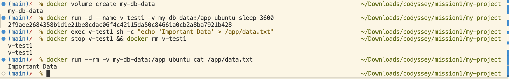
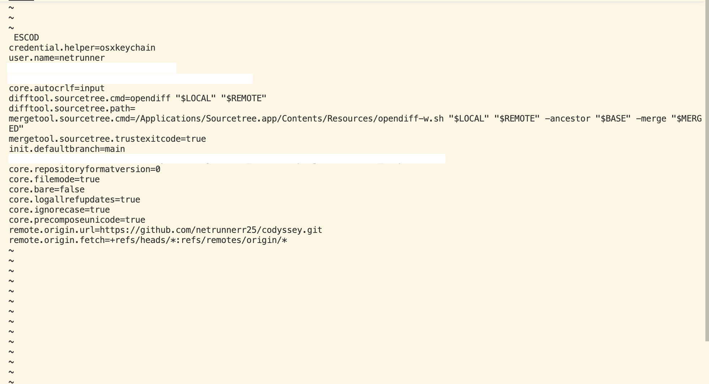

# 미션1. 내 컴퓨터에 개발자용 '작업실' 꾸미기

## 1. 프로젝트 개요

* **미션 목표**: 터미널 기본 조작, Docker(OrbStack) 컨테이너화, 데이터 영속성, Git/GitHub 연동을 실습하고 개발 워크스테이션 환경을 검증합니다.

## 2. 실행 환경

* **OS**: macOS (Apple Silicon / Intel)
* **Shell**: zsh
* **Docker**: OrbStack / Docker Desktop Engine (Version 29.3.1)
* **Git**: 2.x

## 3. 수행 항목 체크리스트

* [x] 터미널 기본 조작 및 권한 변경
* [x] Docker 점검 및 컨테이너 실습
* [x] Dockerfile 커스텀 이미지 제작
* [x] 포트 매핑 및 브라우저 접속 검증
* [x] 바인드 마운트 & 볼륨 영속성 검증
* [x] Git/GitHub/VSCode 연동

---

## 4. 수행 로그 및 개념 설명

### 4.1 터미널 조작 & 파일 권한

* **절대 경로 vs 상대 경로 차이**
* **절대 경로**: 최상위 루트 디렉토리(`/`)를 기준으로 파일이나 디렉터리의 전체 위치를 표기하는 방식 (예: `/Users/admin/Downloads/codyssey/test_dir`)
* **상대 경로**: 현재 위치(`.`)를 기준으로 대상의 위치를 표기하는 방식 (예: `../test_dir`, `./index.html`)


* **권한(r/w/x, 755/644) 설명**
* `r` (Read=4), `w` (Write=2), `x` (Execute=1)
* `755` (`rwxr-xr-x`): 소유자는 읽기/쓰기/실행(7), 그룹 및 기타 사용자는 읽기/실행(5) 권한을 가짐 (디렉토리 기본 권한).
* `644` (`rw-r--r--`): 소유자는 읽기/쓰기(6), 그룹 및 기타 사용자는 읽기(4) 권한만 가짐 (일반 파일 기본 권한).


#### 🧪 터미널 조작 및 권한 실습 로그

```bash
# 1. 현재 위치 확인 및 목록 조회
$ pwd
/Users/admin/Downloads/codyssey

$ ls -la
total 8
drwxr-xr-x@  5 admin  staff  160 Jul 28 16:51 .
drwx------@ 17 admin  staff  544 Jul 28 16:50 ..
drwxr-xr-x@ 10 admin  staff  320 Jul 28 16:49 .git
-rw-r--r--@  1 admin  staff   44 Jul 28 16:05 README.md
drwxr-xr-x@  3 admin  staff   96 Jul 29 11:12 codyssey 

# 2. 이동, 생성, 복사, 이동/이름 변경
$ touch test.txt
$ mkdir test_dir
$ cd test_dir
$ pwd
/Users/admin/Downloads/codyssey/test_dir
$ cd ..

$ cp test.txt copy.txt
$ mv copy.txt test_dir/newcopy.txt

$ echo "Hello codessey" > newcopy.txt
$ cat newcopy.txt
Hello codessey
$ rm test.txt

# 3. 파일 권한 변경 실습 (644 -> 755)
$ ls -l newcopy.txt
-rw-r--r--@ 1 admin  staff  15 Jul 29 11:47 newcopy.txt

$ chmod 755 newcopy.txt
$ ls -l newcopy.txt
-rwxr-xr-x@ 1 admin  staff  15 Jul 29 11:47 newcopy.txt

# 4. 디렉토리 권한 변경 실습 (755 -> 700)
$ ls -ld test_dir
drwxr-xr-x@ 3 admin  staff  96 Jul 29 11:45 test_dir

$ chmod 700 test_dir
$ ls -ld test_dir
drwx------@ 3 admin  staff  96 Jul 29 11:45 test_dir

```

---

### 4.2 Docker 기본 실습

* **Docker 데몬 및 환경 확인**

```bash
$ docker --version
Docker version 29.3.1, build c2be9cc

$ docker info
Downloads/codyssey
Client:
 Version:    29.3.1
 Context:    desktop-linux
 Debug Mode: false
 Plugins:
  agent: Docker AI Agent Runner (Docker Inc.)
    Version:  v1.32.4
    Path:     /Users/admin/.docker/cli-plugins/docker-agent
  ai: Docker AI Agent - Ask Gordon (Docker Inc.)
    Version:  v1.20.1
    Path:     /Users/admin/.docker/cli-plugins/docker-ai
  buildx: Docker Buildx (Docker Inc.)
    Version:  v0.32.1-desktop.1
    Path:     /Users/admin/.docker/cli-plugins/docker-buildx
  compose: Docker Compose (Docker Inc.)
    Version:  v5.1.0
    Path:     /Users/admin/.docker/cli-plugins/docker-compose
  debug: Get a shell into any image or container (Docker Inc.)
    Version:  0.0.47
    Path:     /Users/admin/.docker/cli-plugins/docker-debug
  desktop: Docker Desktop commands (Docker Inc.)
    Version:  v0.3.0
    Path:     /Users/admin/.docker/cli-plugins/docker-desktop
  dhi: CLI for managing Docker Hardened Images (Docker Inc.)
    Version:  v0.0.0-alpha
    Path:     /Users/admin/.docker/cli-plugins/docker-dhi
  extension: Manages Docker extensions (Docker Inc.)
    Version:  v0.2.31
    Path:     /Users/admin/.docker/cli-plugins/docker-extension
  init: Creates Docker-related starter files for your project (Docker Inc.)
    Version:  v1.4.0
    Path:     /Users/admin/.docker/cli-plugins/docker-init
  mcp: Docker MCP Plugin (Docker Inc.)
    Version:  v0.40.1
    Path:     /Users/admin/.docker/cli-plugins/docker-mcp
  model: Docker Model Runner (Docker Inc.)
    Version:  v1.1.5
    Path:     /Users/admin/.docker/cli-plugins/docker-model
  offload: Docker Offload (Docker Inc.)
    Version:  v0.5.73
    Path:     /Users/admin/.docker/cli-plugins/docker-offload
  pass: Docker Pass Secrets Manager Plugin (beta) (Docker Inc.)
    Version:  v0.0.24
    Path:     /Users/admin/.docker/cli-plugins/docker-pass
  sandbox: Docker Sandbox (Docker Inc.)
    Version:  v0.12.0
    Path:     /Users/admin/.docker/cli-plugins/docker-sandbox
  sbom: View the packaged-based Software Bill Of Materials (SBOM) for an image (Anchore Inc.)
    Version:  0.6.0
    Path:     /Users/admin/.docker/cli-plugins/docker-sbom
  scout: Docker Scout (Docker Inc.)
    Version:  v1.20.2
    Path:     /Users/admin/.docker/cli-plugins/docker-scout

Server:
 Containers: 0
  Running: 0
  Paused: 0
  Stopped: 0
 Images: 0
 Server Version: 29.3.1
 Storage Driver: overlayfs
  driver-type: io.containerd.snapshotter.v1
 Logging Driver: json-file
 Cgroup Driver: cgroupfs
 Cgroup Version: 2
 Plugins:
  Volume: local
  Network: bridge host ipvlan macvlan null overlay
  Log: awslogs fluentd gcplogs gelf journald json-file local splunk syslog
 CDI spec directories:
  /etc/cdi
  /var/run/cdi
 Swarm: inactive
 Runtimes: io.containerd.runc.v2 runc
 Default Runtime: runc
 Init Binary: docker-init
 containerd version: dea7da592f5d1d2b7755e3a161be07f43fad8f75
 runc version: v1.3.4-0-gd6d73eb8
 init version: de40ad0
 Security Options:
  seccomp
   Profile: builtin
  cgroupns
 Kernel Version: 6.12.76-linuxkit
 Operating System: Docker Desktop
 OSType: linux
 Architecture: aarch64
 CPUs: 10
 Total Memory: 7.653GiB
 Name: docker-desktop
 ID: 9caf50e4-ff40-44a1-96ae-8bcbe4bcb59f
 Docker Root Dir: /var/lib/docker
 Debug Mode: false
 HTTP Proxy: http.docker.internal:3128
 HTTPS Proxy: http.docker.internal:3128
 No Proxy: hubproxy.docker.internal
 Labels:
  com.docker.desktop.address=unix:///Users/admin/Library/Containers/com.docker.docker/Data/docker-cli.sock
 Experimental: false
 Insecure Registries:
  hubproxy.docker.internal:5555
  ::1/128
  127.0.0.0/8
 Live Restore Enabled: false

```

* **hello-world & ubuntu 컨테이너 실행**

```bash
$ docker run hello-world
Hello from Docker!
This message shows that your installation appears to be working correctly.

$ docker run -it ubuntu bash
root@a1b2c3d4e5f6:/# ls -la
root@a1b2c3d4e5f6:/# echo "Hello Ubuntu"
Hello Ubuntu
root@a1b2c3d4e5f6:/# cat /etc/issue
Ubuntu 26.04 LTS \n \l
root@a1b2c3d4e5f6:/# exit

```

* **컨테이너 종료 vs 유지 및 attach vs exec 개념**
* **`docker run -it ... exit`**: 대화형 터미널 메인 프로세스(`bash`)가 종료되면서 컨테이너도 함께 정지(Exited)됩니다.
* **`docker run -d` & `docker exec**`: 백그라운드로 실행 중인 컨테이너에 `exec`로 들어가 진입한 경우, `exit`으로 빠져나와도 메인 프로세스가 살아있으므로 **실행(Up) 상태**를 유지합니다.
* **`attach` vs `exec**`: `attach`는 실행 중인 컨테이너의 표준 입출력 스트림(메인 프로세스)에 직접 연결되고, `exec`는 실행 중인 컨테이너 내부에 새로운 독립 프로세스를 추가 실행합니다.


---

### 4.3 Dockerfile 커스텀 웹 서버 & 포트 매핑

* **베이스 이미지 선택 이유 및 커스텀 포인트**
* **베이스 이미지 (`nginx:alpine`)**: 초경량 OS 기반의 Nginx 서버로, 리소스 경량화 및 빠른 빌드속도를 위해 선택했습니다.
* **커스텀 포인트**: 호스트 디렉토리의 `src/index.html` 파일을 컨테이너 내부 웹 루트 경로(`/usr/share/nginx/html/`)로 복사하도록 작성했습니다.


* **Dockerfile 파일 내용**

```dockerfile
FROM nginx:alpine
COPY src/ /usr/share/nginx/html/
EXPOSE 80

```

* **빌드 및 포트 매핑 실행 로그**

```bash
# 이미지 빌드
$ docker build -t my-custom-app:1.0 .
[+] Building 1.4s (7/7) FINISHED
 => naming to docker.io/library/my-custom-app:1.0
 => unpacking to docker.io/library/my-custom-app:1.0

# 기존 컨테이너 정리 및 새 포트 매핑 실행 (호스트 8080 <-> 컨테이너 80)
$ docker stop my-app-container && docker rm my-app-container
$ docker run -d -p 8080:80 --name my-app-container my-custom-app:1.0

# 터미널 응답 확인
$ curl http://localhost:8080
<h1>Hello Docker Build!</h1>

```

* **포트 매핑이 필요한 이유**
* Docker 컨테이너는 호스트 OS와 격리된 고유의 가상 네트워크(IP)를 갖습니다. 따라서 외부(호스트 컴퓨터의 브라우저)에서 컨테이너 내부 서비스(예: 80번 포트)에 접근하려면 호스트의 포트(예: 8080번)와 컨테이너의 포트를 연결해 주는 포트 매핑(`-p 호스트포트:컨테이너포트`)이 필수적입니다.


---

### 4.4 바인드 마운트 & 볼륨 영속성

* **Docker 볼륨 개념**
* 기본적으로 컨테이너 내부 데이터는 컨테이너가 삭제되면 함께 사라집니다. 이를 방지하고 데이터를 영구 보관(영속성)하기 위해 **바인드 마운트(Host 경로와 직접 연결)** 또는 Docker 볼륨(Docker가 관리하는 별도 저장 공간)을 사용합니다.


* **바인드 마운트 실습 로그 (소코드)**

```bash
# 호스트 디렉토리를 컨테이너와 실시간 연결
$ docker run -d -p 8081:80 -v $(pwd)/src:/usr/share/nginx/html --name bind-test-container nginx:alpine

# 호스트에서 index.html 수정 후 재접속 시 즉시 반영됨을 확인
$ echo "<h1>Updated content via Bind Mount</h1>" > src/index.html
$ curl http://localhost:8081
<h1>Updated content via Bind Mount</h1>

```

* **볼륨 생성 및 데이터 유지 검증 로그**

```bash
# 1. 볼륨 생성
$ docker volume create my-db-data

# 2. 볼륨을 마운트한 컨테이너 실행 및 데이터 작성
$ docker run -d --name v-test1 -v my-db-data:/app ubuntu sleep 3600
$ docker exec v-test1 sh -c "echo 'Important Data' > /app/data.txt"

# 3. 첫 번째 컨테이너 삭제
$ docker stop v-test1 && docker rm v-test1

# 4. 동일한 볼륨으로 새 컨테이너 실행 후 데이터 검증
$ docker run --rm -v my-db-data:/app ubuntu cat /app/data.txt
Important Data

```



---

### 4.5 Git & GitHub 연동

* **Git vs GitHub 차이점**
* **Git**: 로컬 컴퓨터에서 코드 변경 이력을 관리하는 분산 버전 관리 시스템(VCS)입니다.
* **GitHub**: Git으로 관리되는 프로젝트 이력을 원격 서버에 저장하고 팀원과 협업할 수 있게 해주는 **웹 기반 원격 저장소 서비스**입니다.


* **Git 설정 및 VSCode 연동**

```bash
$ git config --list
```



---

## 5. 트러블슈팅 (2건)

### 1. zsh 특수문자(`!`) 파싱 오류로 인한 파일 작성 실패

* **문제 발생**: `echo "<h1>Hello Docker Build!</h1>" > src/index.html` 명령 실행 시 `zsh: event not found: </h1>` 에러가 발생하며 파일 생성이 되지 않음.
* **원인 가설**: zsh Shell 환경에서 큰따옴표(`" "`) 내부의 느낌표(`!`)를 명령 이력(History) 탐색용 특수문자로 해석하여 구문 오류가 발생했을 것이다.
* **해결 방법**: 문자열을 작은따옴표(`' '`)로 감싸서 실행하거나 `!` 문자 앞에 백슬래시(`\!`)를 붙여 이스케이프 처리함으로써 문제 해결. (`echo '<h1>Hello Docker Build!</h1>' > src/index.html`)

### 2. 경로 미치에 따른 `index.html` 전달 누락 문제

* **문제 발생**: Docker 이미지가 성공적으로 빌드되고 컨테이너가 실행되었으나, `curl http://localhost:8080` 수행 시 빈 화면(줄바꿈)만 출력됨.
* **원인 가설**: 이미 `src` 디렉터리 내부로 진입한 상태에서 `echo ... > src/index.html`을 실행하여 `src/src/index.html` 경로로 파일이 들어가거나, 상위 디렉터리 경로 오차로 빈 `src` 폴더가 빌드 컨텍스트로 전달되어 COPY 되었을 것이다.
* **해결 방법**: 터미널 프롬프트 상의 현재 위치(`pwd`)를 명확히 확인한 후, 프로젝트 루트 디렉터리(`my-project`)로 이동하여 정상 위치에 `src/index.html`을 생성하고 `docker build -t my-custom-app:1.0 .`으로 이미지 재빌드 후 컨테이너 재시작하여 해결함.